# 🌐 Akıllı Link Ağacı Web Uygulaması

---

## 📌 İçindekiler / Table of Contents

### 🇹🇷 Türkçe
- [🧠 Proje Amacı](#-proje-amacı)
- [🔧 Teknik Özellikler](#-teknik-özellikler)
- [🎨 Arayüz & Kullanıcı Deneyimi](#-arayüz--kullanıcı-deneyimi)
- [📁 Kullanılan Teknolojiler](#-kullanılan-teknolojiler)

### 🇬🇧 English
- [🧠 Purpose of the Project](#-purpose-of-the-project)
- [🔧 Technical Features](#-technical-features)
- [🎨 UI & UX Highlights](#-ui--ux-highlights)
- [📁 Stack & Technologies](#-stack--technologies)

---

Bu proje, tasarımı ve tüm yazılım altyapısı tarafımdan geliştirilen gelişmiş bir Link Ağacı Web Uygulamasıdır. Klasik bağlantı listesi uygulamalarının ötesine geçerek, her ziyaretçinin davranışını takip eden, çok dilli içerik sunan, etkileşimleri analiz eden ve anlık bildirimlerle bilgi sağlayan benzersiz bir sistem barındırmaktadır.

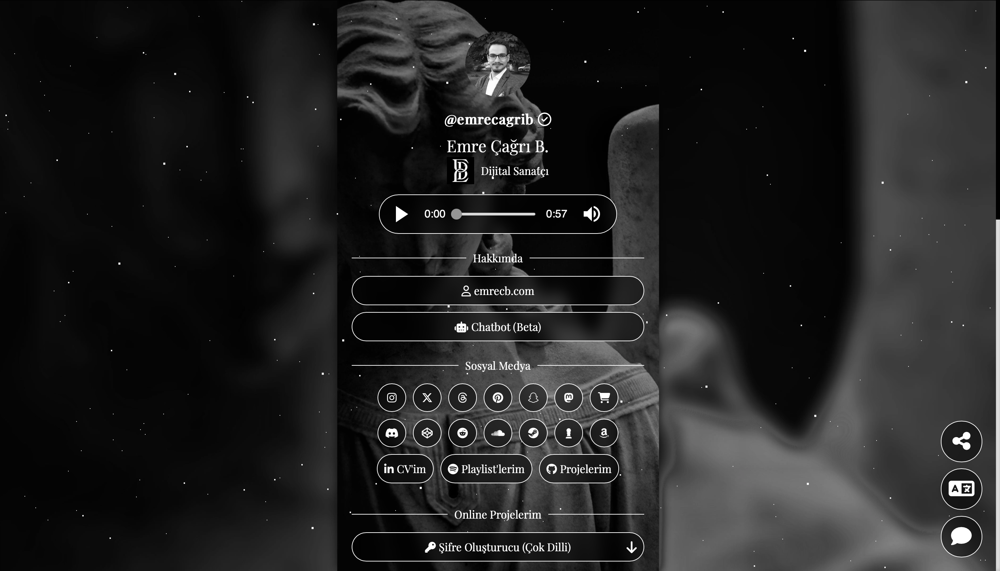

## 🧠 Proje Amacı

Bu uygulama sadece bağlantılarımı listelemekle kalmaz, aynı zamanda her ziyaretçiyi tanır, dil tercihini anlar, anlık olarak analiz eder ve tüm bu süreci gerçek zamanlı olarak bana raporlar.

> Bu sayede kişisel bir portfolyo aracı olmanın ötesine geçerek, pazarlama, kullanıcı davranış analizi ve veri güvenliği açısından da profesyonel bir çözüm sunar.

İstenilen bağlantı devre dışı bırakılarak, kullanıcıya belirlenen uyarı mesajı gösterilir.

---

## 🔧 Teknik Özellikler

### ✅ 1. Token Sistemi (Ziyaretçi Tanımlama & Takip)

- `random_bytes()` ile 32 karakterlik benzersiz bir token üretilir.  
- Token hem çereze (`setcookie()`) yazılır hem de URL’ye eklenir.  
- Bu sayede bir bağlantının kim tarafından, nerede ve ne zaman paylaşıldığı izlenebilir.  
- Eksik veya hatalı token varsa, sistem otomatik olarak doğru token ile yönlendirir.

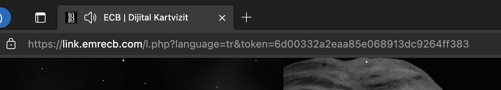

### ✅ 2. Gelişmiş Çerez ve IP Takibi

- Her kullanıcıya `visitor_id` adlı uzun ömürlü bir çerez atanır.  
- Böylece ziyaretçinin daha önce siteye gelip gelmediği tespit edilir.  
- IP, proxy, tarayıcı bilgisi, port, dil, charset ve sıkıştırma bilgileri kaydedilir.

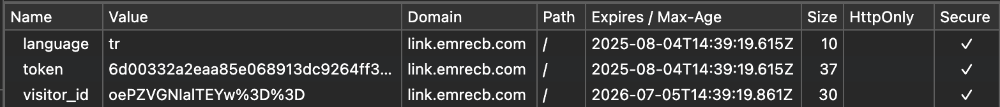

### ✅ 3. Anlık Telegram Bildirimi

- Her ziyaret Telegram üzerinden detaylı şekilde bana iletilir.  
- Bildirimler; IP, yönlendiren bağlantı, tarayıcı bilgisi, sayfa dili, mesaj/puntu içerir.  
- Böylece kullanıcı etkileşimleri gerçek zamanlı olarak izlenebilir.

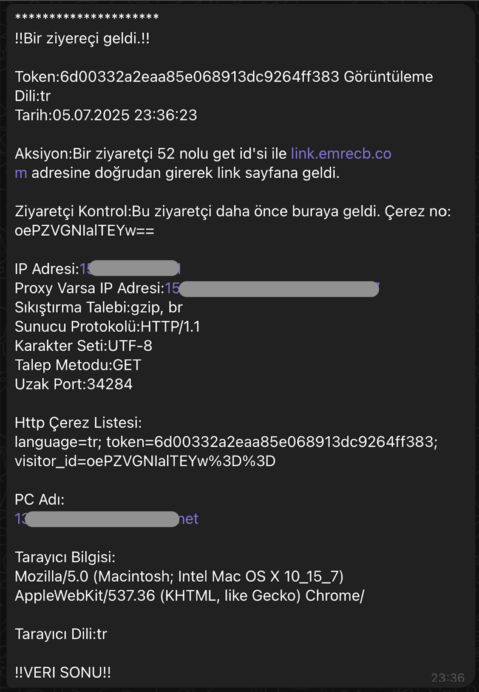

### ✅ 4. Akıllı Paylaşım İzleme

- Tüm bağlantılara otomatik olarak token eklenir.  
- Paylaşılan bağlantılar sayesinde kim tarafından ve hangi platformda paylaşıldığı tespit edilir.  
- `l.php?l=[ID]` formatı ile gelen ziyaretçiler platforma göre ayrıştırılır (Instagram, Twitter, GitHub vb.).

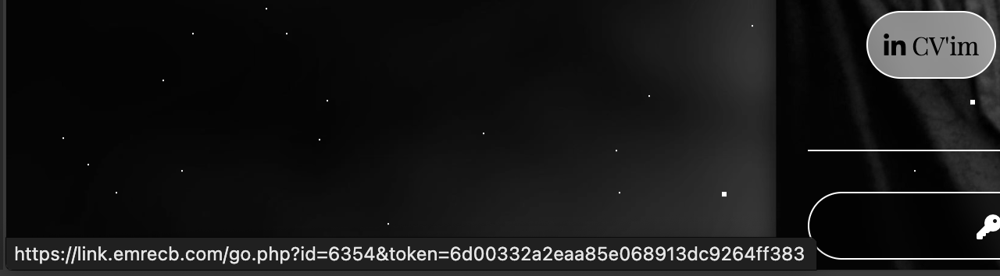

### ✅ 5. Çoklu Dil Desteği (Otomatik & Manuel)

- Metinler sabit HTML yerine değişkenlerle yönetilir.  
- `HTTP_ACCEPT_LANGUAGE` ile tarayıcı dili algılanır ve otomatik dil seçimi yapılır.  
- Ziyaretçi, sağ alttaki butonla dili manuel olarak değiştirebilir.  
- Dil bilgisi çereze kaydedilir ve Telegram üzerinden iletilir.

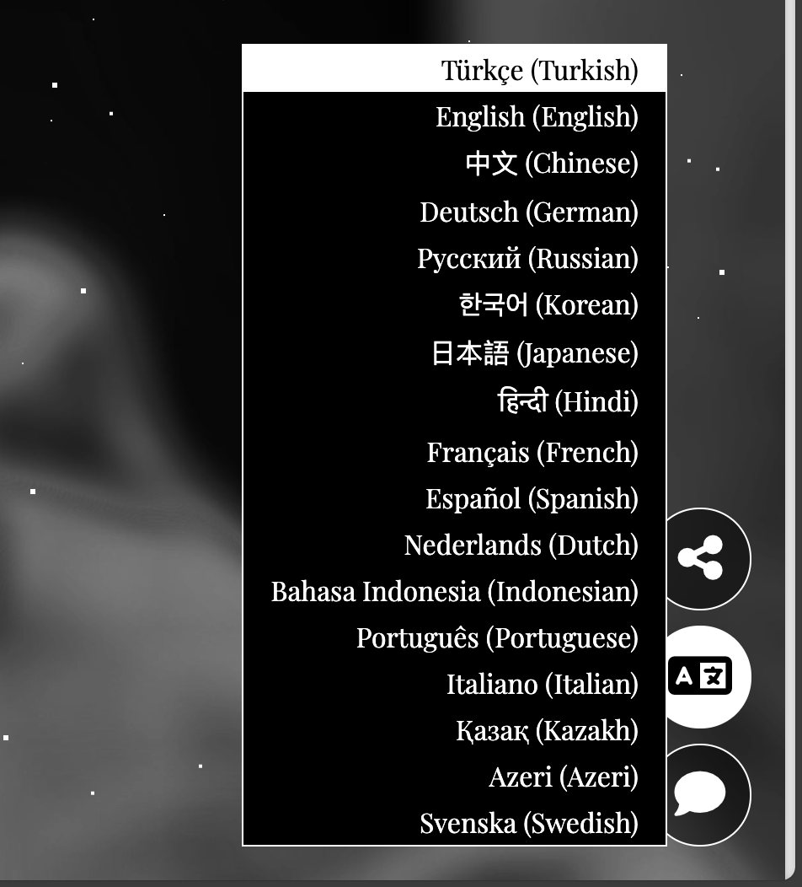

### ✅ 6. Etkileşimli Geri Bildirim (Puanlama & Mesaj)

- Ziyaretçiler yıldızla oylama yapabilir ve mesaj bırakabilir.  
- Mesaj içeriği, puanlama ve dil bilgisi anlık olarak iletilir.  
- Kullanıcı deneyimi ve içerik iyileştirmesi için veri sağlar.

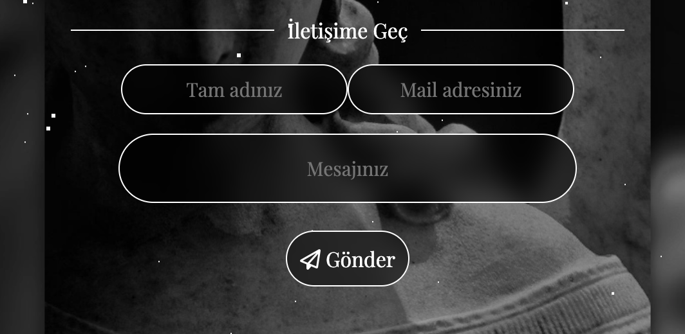
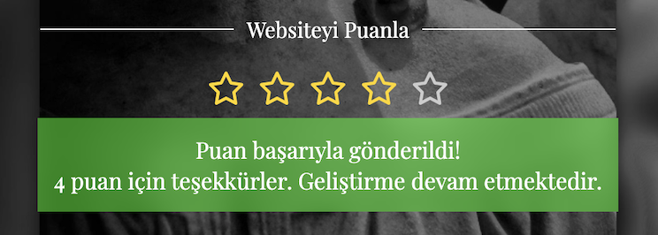

---

## 🎨 Arayüz & Kullanıcı Deneyimi

- Karanlık temalı, mobil uyumlu, responsive tasarım  
- Siyah-beyaz efektli profil fotoğrafı ve geçişli arka planlar  
- Mood paneli, sosyal pil göstergesi  
- Alıntı sistemi, yıldızlı oylama, yorum slaytları ve RSS feed entegrasyonu  
- Sağ alt köşeye sabitlenmiş butonlar (Paylaş, Dil, İletişim)  
- CSS Grid/Flexbox destekli modern arayüz ve geçiş animasyonları

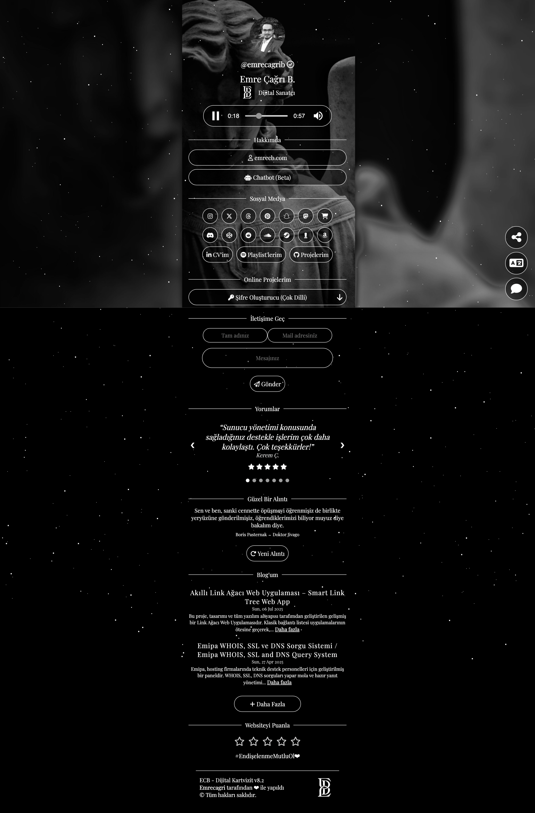

---

## 📁 Kullanılan Teknolojiler

- **PHP**: Token sistemi, yönlendirme, çerez, dil algılama, Telegram API  
- **HTML/CSS**: Özgün arayüz tasarımı  
- **JavaScript**: Menü geçişleri, dil değişimi, animasyonlar, alert sistemleri  
- **Telegram Bot API**: Anlık bildirimler  
- **Cookie yönetimi & Çok dilli çerez sistemi**  
- **Responsive Design (Mobile-first)**

---

# 🌐 Smart Link Tree Web Application

---

This is a fully self-designed and self-developed Smart Link Tree Web Application. It extends beyond basic link sharing with real-time visitor tracking, multilingual support, and Telegram-based live interaction reporting.

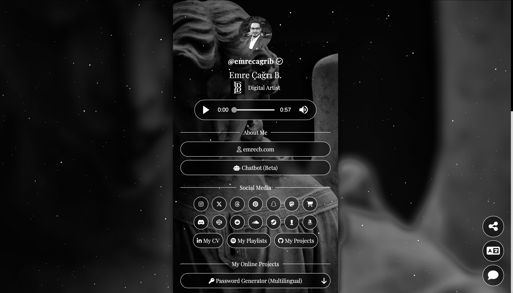

## 🧠 Purpose of the Project

This application does more than list my links — it detects and analyzes each visitor’s behavior in real time, understands their language preference, and sends detailed reports instantly.

> It is a complete personal analytics, marketing, and security solution — not just a portfolio tool.

Disabled links display a predefined warning message to the user.

---

## 🔧 Technical Features

### ✅ 1. Unique Token System

- 32-character unique token generated via `random_bytes()`  
- Stored in cookies and appended to URLs  
- Enables tracking of who, where, and when the link was shared  
- Redirects automatically if token is missing or incorrect

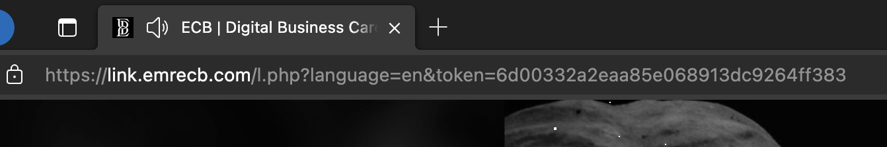

### ✅ 2. Cookie & IP-based Visitor Tracking

- Long-lived `visitor_id` cookie for recognizing returning visitors  
- Logs IP, browser, proxy, charset, language, compression, etc.

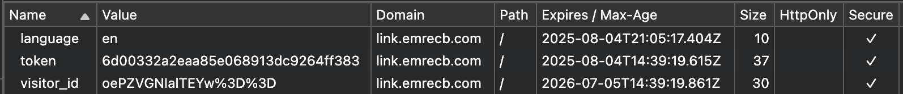

### ✅ 3. Real-Time Telegram Alerts

- Telegram bot sends a detailed message for every visit  
- Includes: referrer, IP, browser, language, feedback rating/message  
- Allows instant monitoring of visitor behavior

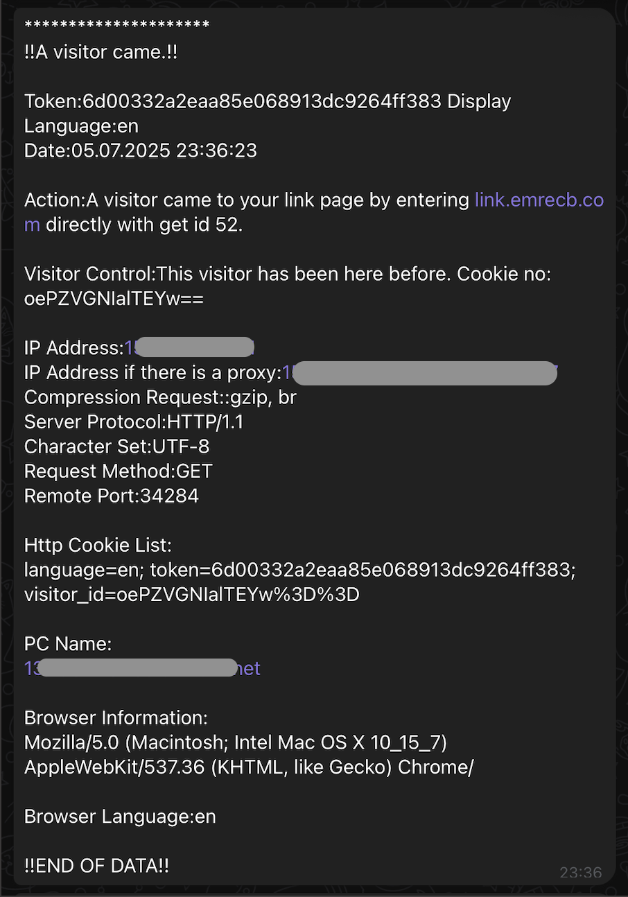

### ✅ 4. Smart Sharing Detection

- All URLs auto-appended with token  
- System identifies where and by whom the link was reshared  
- Supports detection from Instagram, GitHub, Twitter, Threads, etc.

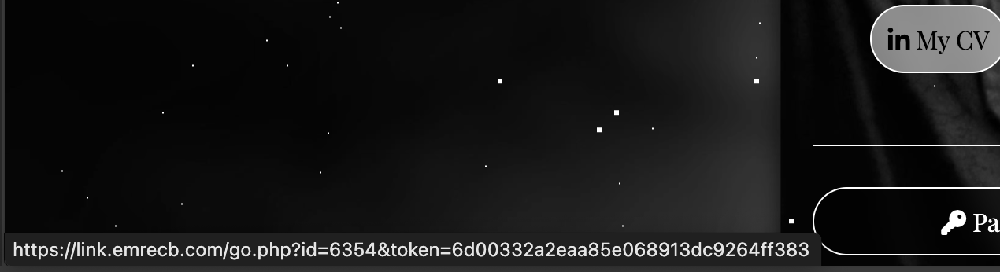

### ✅ 5. Multilingual Support (Auto & Manual)

- All texts are PHP variables — no hardcoded HTML  
- Language auto-detected via `HTTP_ACCEPT_LANGUAGE`  
- Visitors can manually select preferred language via floating button  
- Selection is stored in cookies and included in Telegram data

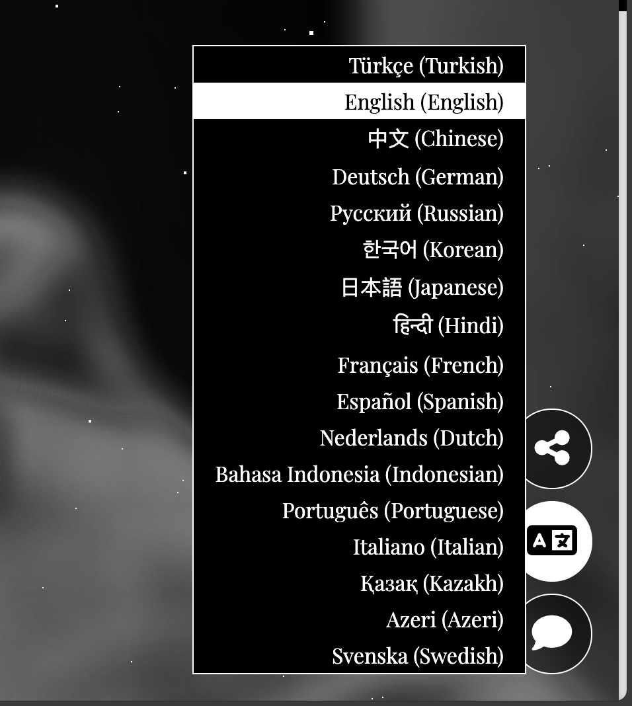

### ✅ 6. Interactive Feedback (Rating & Message)

- Visitors can leave star ratings and messages  
- Feedback, rating, and language are sent instantly  
- Enables real-time user insight and content improvement

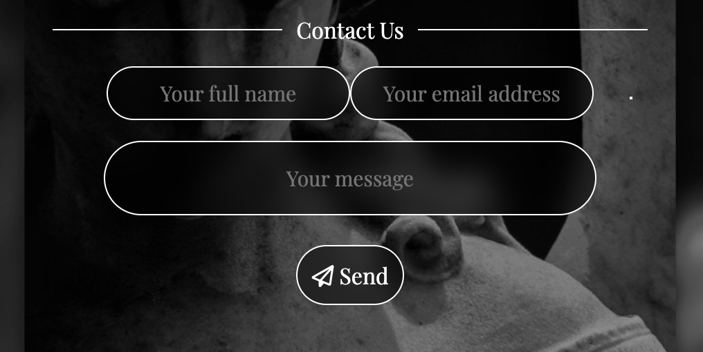

---

## 🎨 UI & UX Highlights

- Dark theme, mobile-first, fully responsive  
- Grayscale profile hover effect, smooth transitions  
- Mood & social battery indicators  
- Daily quotes, feedback sliders, RSS integration  
- Sticky buttons (share, language, contact)  
- CSS Grid/Flex layout with hover/modal effects

---

## 📁 Stack & Technologies

- **PHP**: routing, token/cookie handling, language detection, Telegram Bot API  
- **HTML/CSS**: Handcrafted frontend  
- **JavaScript**: Alerts, animations, dynamic language switching  
- **Telegram Bot API**  
- **Multilingual and cookie-based personalization system**  
- **Responsive design (mobile-first, cross-platform)**
